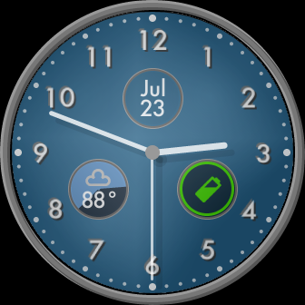
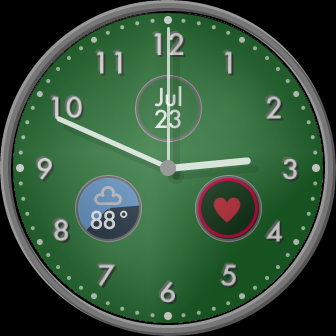
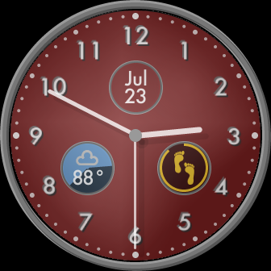
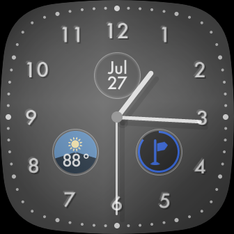
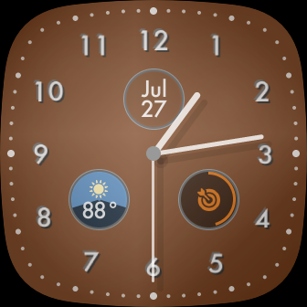

# Blue
## Analog clock with sensor info for Fitbit Versa 3 and Sense
### [Get this clock face from the Fitbit Gallery](https://gallery.fitbit.com/details/3c0ff5ad-50e7-4943-bdcd-f7521ef8e82b)
This is a modern, formal clock face, with date, weather, sunset/sunrise, and sensor information. The background color can be changed in the settings (I originally conceived of this design as being blue, hence the name. Then I realized it would be fun to change the color to suit your mood/clothing/whatever). Tapping the sensor icon cycles through the available sensors.

Included sensors are: 
+ Battery
+ Heart Rate
+ Steps
+ Distance
+ Active Zone Minutes

The clock face can also be switched from round to square in the settings.

This clock has only been tested on Fitbit Versa 3, so please feel free to submit a pull request with any improvements or bug fixes. (Comments and stars are also welcome!)
